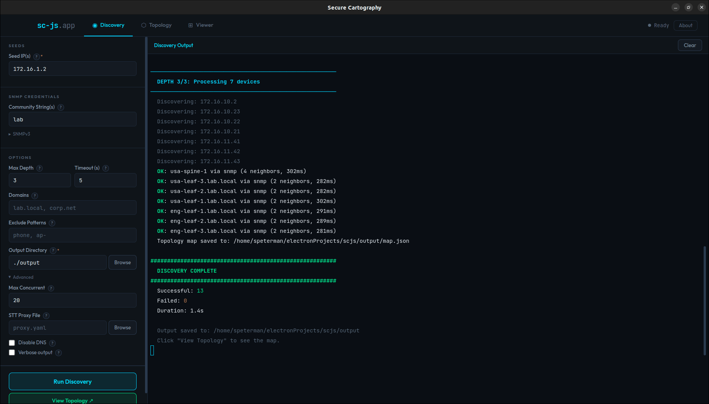
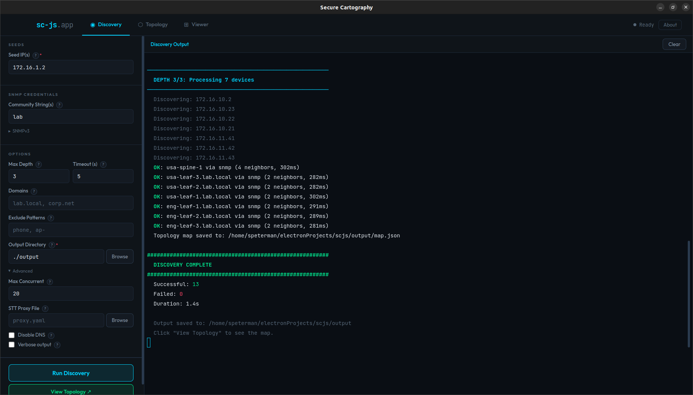
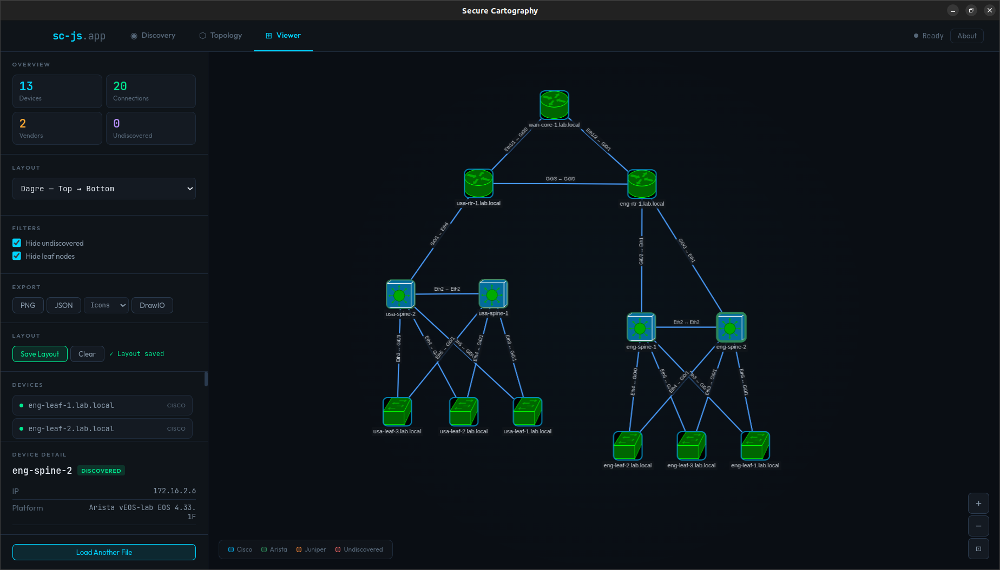

# secure-cartography-js

Recursive SNMP network discovery with topology mapping. Electron desktop app and Node.js CLI.

Point it at a seed IP, give it SNMP credentials, and it crawls CDP/LLDP neighbors recursively — building a complete topology map of every device it can reach. Vendor-colored visualization, multi-format export, layout persistence, and works across Cisco, Arista, Juniper. Leaf node detection can be anything via LLDP.

If you are looking for even more features, or working with more varied authentication issues for your SNMP environment, You might also consider the Python version of Secure Cartography https://github.com/scottpeterman/secure_cartography




## Installation

### Desktop App (recommended)

Download the latest release for your platform:

| Platform | Download |
|----------|----------|
| **Linux** | [Secure Cartography-0.1.0.AppImage](https://github.com/scottpeterman/secure_cartography_js/releases/download/v0.1.0/Secure.Cartography-0.1.0.AppImage) |
| **macOS** (Apple Silicon) | [Secure Cartography JS-0.1.0-arm64.dmg](https://github.com/scottpeterman/secure_cartography_js/releases/download/v0.1.0/Secure.Cartography.JS-0.1.0-arm64.dmg) |
| **Windows** | [Secure Cartography JS Setup 0.1.0.exe](https://github.com/scottpeterman/secure_cartography_js/releases/download/v0.1.0/Secure.Cartography.JS.Setup.0.1.0.exe) |

Linux: `chmod +x` the AppImage and run it. macOS: open the .dmg and drag to Applications. Windows: run the installer.

### From Source (desktop + CLI)

```bash
git clone https://github.com/scottpeterman/secure_cartography_js.git
cd secure_cartography_js
npm install

# Launch the desktop app
npm start

# Or use the CLI directly
npm run sc -- crawl 10.0.0.1 -c community -o ./output
```

## What It Does

- **Discovers** network devices via SNMPv2c/v3 — system info, interfaces, CDP neighbors, LLDP neighbors, ARP tables, hardware inventory
- **Crawls** recursively through neighbor relationships with depth control, configurable concurrency, credential caching, and two-layer dedup
- **Maps** the topology as an interactive graph with nine layout algorithms, vendor-colored icons, device filtering, and persistent layout positions
- **Exports** to DrawIO (Cisco stencil icons or geometric shapes), PNG, and JSON
- **Tunnels** through SSH via STT-SNMP when direct SNMP access isn't available

## Desktop App

The Electron GUI has three views:

**Discovery** — Configure seed IPs, SNMP credentials (v2c communities or v3 user/auth/priv), depth, domains, exclusion patterns, and output directory. Discovery streams to an embedded xterm.js terminal with color-coded device status. Results load automatically into the Topology view on completion.



**Topology** — Interactive Cytoscape.js graph of the discovered network. Nine layout algorithms, node filtering, and full export controls. Same interactive features as the Viewer.

**Viewer** — Standalone map.json loader. Drag and drop or browse for topology files from sc-js, map_pioneer, or VelocityCMDB. Same layout, filter, and export controls as the Topology view.



Both the Topology and Viewer share these features:

- **9 layout algorithms** — Dagre (TB/LR), Breadthfirst, fCoSE, CoSE, Cola, Concentric, Circle, Grid
- **Filtering** — Hide undiscovered placeholder nodes, hide leaf nodes (degree ≤ 1)
- **Layout persistence** — Save and restore node positions, filters, zoom/pan, and layout algorithm to localStorage keyed by file path. Auto-restores on next load. 90-day TTL with auto-prune.
- **3-tier icon resolution** from `platform_map.json` — exact platform string match (longest-first), fallback patterns on platform + hostname, role-based default
- **Vendor color coding** — Cisco (blue), Arista (green), Juniper (orange), Palo Alto (red), Fortinet (red)
- **Device role detection** — Firewall, router, L2 switch, L3 switch — classified by platform model and hostname conventions
- **High-res icons** — SVG icons pre-rasterized to 4× PNG data URIs via offscreen canvas, crisp across 0.1×–4× zoom

```bash
# Run the desktop app
npm start

# Run with DevTools open
npm run dev
```

## Building

Packaged builds use [electron-builder](https://www.electron.build/). Install dev dependencies first:

```bash
npm install

# Linux — AppImage + .deb
npm run build:linux

# Windows — NSIS installer + portable .exe
npm run build:win

# macOS — .dmg
npm run build:mac

# All platforms
npm run build
```

## CLI

The same discovery engine is available as a CLI tool — no GUI required. Use `npm run sc --` as a shortcut for `node src/sc-js.js`:

```bash
npm install

# Quick SNMP reachability test
npm run sc -- test 10.0.0.1 -c private -v

# Single device — full collector suite
npm run sc -- discover 10.0.0.1 -c private -v

# Recursive crawl with topology map output
npm run sc -- crawl 10.0.0.1 -c private -o ./output --max-depth 4

# Multiple community strings (tried in order)
npm run sc -- crawl 10.0.0.1 -c private -c backup_comm -o ./output

# SNMPv3
npm run sc -- crawl 10.0.0.1 --v3-user admin --v3-auth-pass secret --v3-priv-pass secret2 -o ./output

# JSON event stream for pipeline consumers
npm run sc -- crawl 10.0.0.1 -c private --json-events 2>events.jsonl

# Filter firmware LLDP noise from topology map (dual-agent NICs)
npm run sc -- crawl 10.0.0.1 -c private -o ./output --peer-exclude "Broadcom Adv." "fw_version:"

# Discovery through STT-SNMP tunnel
npm run sc -- crawl 10.0.0.1 -c private --stt-file proxy.yaml --max-depth 3 -o ./output -v
```

## Export Formats

| Format | Mode | Description |
|--------|------|-------------|
| **DrawIO** | Icons | Cisco stencil shapes from `platform_map.json`, vendor-colored fills, interface labels. Requires DrawIO stencil library. |
| **DrawIO** | Shapes | Geometric forms (hexagon=router, octagon=firewall, rectangle=switch), vendor colors, no stencil dependencies. Universally portable. |
| **PNG** | — | Raster screenshot at 2× resolution with dark background |
| **JSON** | — | Raw map.json topology data for VelocityCMDB, Day 2 tools, scripting |

Both DrawIO modes capture positions from the current Cytoscape layout, include hostname/IP/platform labels, and use vendor-specific fill colors. The Icons/Shapes selector is in the sidebar next to the DrawIO export button.

## SNMP Credentials

The engine supports both SNMPv2c and SNMPv3:

**v2c** — One or more community strings, tried in order per device. First successful credential per /24 subnet is cached, so subsequent devices in the same subnet skip credential cycling.

**v3** — Full authentication and privacy support:
- Auth protocols: none, MD5, SHA, SHA-224, SHA-256, SHA-384, SHA-512
- Privacy protocols: none, DES, AES, AES-256

Configure via CLI flags or the GUI's credential form.

## STT-SNMP Tunnel Support

Discover networks through [STT-SNMP](https://github.com/scottpeterman/sttconcept) tunnels — SNMP over SSH terminal sessions. No VPN, no listening ports on the remote side, no firewall changes.

```bash
# Generate port map from an existing topology
node src/stt-gen.js map.json -o proxy.yaml --ssh-host bastion --ssh-user admin

# Start the STT proxy (separate terminal)
python -m sttsnmp.snmpproxy_local -c proxy.yaml

# Crawl through the tunnel
npm run sc -- crawl 172.16.100.2 -c lab --stt-file proxy.yaml --max-depth 3 -o ./output -v
```

The engine transparently remaps device IPs to `localhost:<port>` via `_resolveTarget()`. Collectors, dedup, and topology builder have no awareness of the transport — device real IPs remain the identity throughout.

## Vendor Support

| Vendor | Platform | Protocols | Transport | Tested |
|--------|----------|-----------|-----------|--------|
| Cisco | IOSv 15.6, IOS 15.2, 7200 | CDP + LLDP | Direct, STT | ✅ |
| Arista | vEOS-lab 4.33.1F | LLDP | Direct, STT | ✅ |
| Juniper | JUNOS 14.1R1.10 | LLDP | STT | ✅ |
| Mixed | Multi-vendor leaf-spine fabrics | CDP + LLDP | STT | ✅ |

Largest tested: 109 devices across multiple tiers, two sites, three vendors.

## How It Works

```
Electron App / CLI
  → DiscoveryEngine.crawl(seeds, depth, domains)
    → For each depth level (breadth-first):
      → For each target (concurrent, configurable limit):
        → _resolveTarget() — STT proxy remap if configured
        → _getWorkingCredential() — try each credential, cache by /24
        → NetSnmpWalker created (one UDP session per device)
        → Collectors run in sequence:
          1. getSystemInfo()              — sysName, sysDescr, sysObjectID, uptime
          2. getInterfaceTableExtended()  — ifName, ifDescr, ifAlias, status, MAC, speed
          3. getCdpNeighbors()            — CDP neighbor table with platform, capabilities
          4. getLldpNeighbors()           — LLDP with subtype decoding, mgmt addresses
          5. getArpTable()               — MAC → IP mapping (optional)
        → Device assembled, walker closed in try/finally
      → Neighbors deduped (sysName + IP claim), queued for next depth
      → MAC-named LLDP neighbors resolved via lightweight sysName probe
      → Events emitted → terminal output / IPC to Electron renderer
    → map.json + per-device JSON written to output directory
    → Topology map generation:
      → Neighbors sorted (hostnames before MACs) for deterministic dedup
      → peer_exclude patterns filtered before first-one-wins gate
      → Eliminates phantom diffs from dual LLDP agents on server NICs
```

**Walker-per-device** — Each device gets its own `NetSnmpWalker` wrapping a `net-snmp` UDP session. Created, used for all collectors, closed in try/finally. Guarantees socket cleanup even on large crawls.

**Two-layer dedup** — Queue-time dedup by sysName/IP prevents queuing duplicates. Post-discovery dedup catches multi-homed devices where two IPs in the same concurrent batch resolve to the same sysName.

**Credential caching** — First successful SNMP credential per /24 subnet is cached. Devices in the same subnet skip credential cycling entirely.

**Interface normalization** — GigabitEthernet → Gi, TenGigabitEthernet → Te, Ethernet → Eth, Port-channel → Po, Juniper `.0` subinterface stripped. Consistent across all output formats.

**Two exclusion mechanisms** — `--exclude` filters devices during discovery (by sysDescr/hostname pattern — the device is never crawled). `--peer-exclude` filters peer entries from the topology map at generation time (the device is still discovered and appears in per-device JSON — it just doesn't pollute map.json as a named peer). Use `--exclude` for networks you don't own; use `--peer-exclude` for NIC firmware noise.

## API Documentation

Full JSDoc API documentation is included in the [`docs/`](docs/index.html) directory. The documentation covers all public modules:

| Module | Description |
|--------|-------------|
| **engine** | `DiscoveryEngine` — crawl orchestrator, concurrency, dedup, credential caching |
| **walker** | `NetSnmpWalker` — net-snmp session wrapper (v2c + v3), SNMP walk/get operations |
| **lldp** | LLDP-MIB neighbor collector with subtype decoding and management addresses |
| **main** | Electron main process, IPC handlers, native dialogs |
| **sc-js** | CLI entry point (commander) — test, discover, crawl subcommands |

Additional documented classes include `DiscoveryEmitter`, `ConsoleEventPrinter`, and `SimpleCreds`. The docs also cover all data models (`Device`, `Neighbor`, `Interface`, `DiscoveryResult`), SNMP OID constants, value parsers, and individual collectors for system info, interfaces, CDP, LLDP, and ARP.

To browse locally, open `docs/index.html` in a browser. To regenerate after code changes:

```bash
npm run docs
```

## Platform Icon Resolution

Both the Cytoscape viewer and DrawIO export resolve device icons through the same 3-tier chain driven by `assets/platform_map.json`:

| Tier | Source | Example |
|------|--------|---------|
| **T1** | `platform_patterns` — exact substring match on platform string, longest-first | `"C9407R"` → multilayer_switch |
| **T2** | `fallback_patterns` — keyword match on platform string + hostname | platform contains `"junos"` → router |
| **T3** | Role detection — classify by platform model + hostname conventions | hostname contains `"leaf-"` → L2 switch |

The platform map contains 228 platform patterns covering Cisco (Catalyst, Nexus, ISR, ASR), Arista (7000/7100/7200/7300/7500/7800, vEOS), Juniper (MX, PTX, ACX, QFX, EX, SRX), and 7 fallback pattern rules. Adding new hardware is a JSON edit — no code changes required.

## Layout Persistence

Node positions, filter state, zoom/pan, and selected layout algorithm are saved to `localStorage` keyed by the full file path. When the same map.json is loaded again, the saved layout is restored automatically.

- **Save** — click "Save Layout" in the sidebar, or clear with "Clear"
- **Restore** — automatic on file load when a saved layout exists for that path
- **Changed topology** — if devices were added or removed since the layout was saved, existing nodes get their saved positions and new nodes remain at their default positions
- **TTL** — saved layouts expire after 90 days, pruned automatically on app startup

## Output Format

The `map.json` output is a flat object keyed by device hostname:

```json
{
  "router-1.lab.local": {
    "node_details": {
      "ip": "172.16.100.2",
      "platform": "Cisco IOSv IOS 15.6(2)T",
      "vendor": "cisco"
    },
    "peers": {
      "switch-1.lab.local": {
        "connections": [["Gi0/1", "Eth1"]]
      }
    }
  }
}
```

Per-device JSON files contain full collector output (system info, interface table, neighbor tables, ARP) for Day 1/Day 2 tool consumption. Interface names are normalized, JSON keys use snake_case for Python ecosystem compatibility.

Cross-compatible with map_pioneer, VelocityCMDB, and SC Map Viewer.

## Project Layout

```
scjs/
├── package.json
├── main.js                         # Electron main process, IPC handlers, native dialogs
├── preload.js                      # IPC bridge (renderer ↔ main, contextIsolation)
├── index.html                      # App shell — three-tab layout, sidebar controls
├── renderer.js                     # Tab navigation, IPC events, terminal, export, layout persistence
├── topology.js                     # CytoscapeViewer — graph rendering, layouts, filtering, icons
├── drawio-export.js                # DrawIO XML generator (icons + shapes modes, also Node.js usable)
├── splash.html                     # Startup splash screen
├── jsdoc.json                      # JSDoc configuration
├── docs-home.md                    # JSDoc landing page content
├── platform_icon_drawio.json       # DrawIO icon shape mapping
├── assets/
│   ├── icons/                      # SVG device icons (router, L3 switch, L2 switch, firewall, etc.)
│   └── platform_map.json           # 228 platform patterns + 7 fallback rules → DrawIO shape mapping
├── src/
│   ├── sc-js.js                    # CLI entry point (commander)
│   ├── engine.js                   # Crawl orchestrator — concurrency, dedup, credential caching
│   ├── walker.js                   # net-snmp session wrapper (v2c + v3)
│   ├── models.js                   # Device, Neighbor, Interface, DiscoveryResult
│   ├── events.js                   # DiscoveryEmitter + event printers
│   ├── creds.js                    # Credential providers (v2c + v3)
│   ├── stt-gen.js                  # STT port map generator + runtime lookup
│   ├── oids.js                     # SNMP OID constants (numeric, no MIB resolution)
│   ├── parsers.js                  # Value decoding, vendor detection, hostname processing
│   ├── system.js                   # SNMPv2-MIB system group collector
│   ├── interfaces.js               # IF-MIB interface table collector
│   ├── cdp.js                      # CISCO-CDP-MIB neighbor collector
│   ├── lldp.js                     # LLDP-MIB neighbor collector (subtype decoding, mgmt addresses)
│   └── arp.js                      # IP-MIB ARP table collector
├── screenshots/
│   ├── discover.png
│   ├── topology.png
│   ├── viewer.png
│   └── slides1.gif
├── docs/                           # Generated JSDoc API documentation
│   ├── index.html                  # Documentation entry point
│   ├── module-engine.html          # DiscoveryEngine API
│   ├── module-walker.html          # NetSnmpWalker API
│   ├── module-lldp.html            # LLDP collector API
│   └── ...                         # Additional module and class docs
└── test_client.js                  # SNMP test harness
```

## Key Design Decisions

**Walker-per-device** — Each device gets its own `NetSnmpWalker` with its own `net-snmp` UDP session. Created, used for all five collectors, closed in try/finally. Guarantees socket cleanup on large crawls.

**Two-layer dedup** — Queue-time dedup by sysName/IP prevents queuing duplicates. Post-discovery dedup catches multi-homed devices where two IPs in the same concurrent batch resolve to the same sysName.

**STT transparent routing** — Only `_resolveTarget()` and the walker know about the tunnel. Collectors, parsers, models, and topology builder have zero awareness of the transport layer.

**Credential caching by /24** — First successful SNMP credential per subnet is cached. Subsequent devices in the same subnet skip credential cycling entirely.

**LLDP topology determinism** — Server NICs with dual LLDP agents (firmware + OS-level) produce multiple entries per port in `lldpRemTable`. The SNMP walk order of these entries can shift between queries due to `lldpRemTimeMark` / `sysUpTime` interaction (RFC 2021 TimeFilter). The topology map generator sorts neighbors so hostname-identified entries always win the per-interface dedup gate over bare MAC addresses, and `--peer-exclude` filters firmware description strings (e.g. Broadcom NIC identifiers) that aren't MAC addresses but still compete with real hostnames. Together these eliminate phantom topology diffs between consecutive crawls on unchanged networks.

**Single platform map, two consumers** — `platform_map.json` stores DrawIO shape names. The Cytoscape viewer converts them to SVG filenames; the DrawIO exporter uses them directly. One source of truth, both outputs match.

**Main-process engine** — The discovery engine runs on Electron's main process event loop. It's I/O-bound (UDP sockets), not CPU-bound, so no worker thread is needed. Events stream to the renderer via IPC with JSON round-trip serialization.

**Cross-compatible output** — map.json format matches map_pioneer, VelocityCMDB, and SC Map Viewer. snake_case keys for Python ecosystem compatibility; camelCase internal to JavaScript.

## Dependencies

```json
{
  "dependencies": {
    "commander": "^12.0.0",
    "net-snmp": "^3.11.2"
  },
  "devDependencies": {
    "clean-jsdoc-theme": "^4.3.0",
    "electron": "^33.0.0",
    "electron-builder": "^25.1.8",
    "jsdoc": "^4.0.5"
  }
}
```

Two production dependencies for the discovery engine. Electron, electron-builder, JSDoc, and the clean-jsdoc-theme are dev-only. The Electron app loads Cytoscape.js, Dagre, fCoSE, Cola, and xterm.js from CDN.

## Lineage

Ported from [map_pioneer](https://github.com/scottpeterman/map_pioneer) (Python), itself extracted from [Secure Cartography](https://github.com/scottpeterman/secure_cartography). The JS port compresses 5,195 lines of Python into ~5,100 lines of JavaScript — the engine (1,364 → 1,057) and events (650 → 440) see the biggest reduction where Node's native async and EventEmitter replace asyncio boilerplate. The Electron GUI, topology viewer, DrawIO exporter, and layout persistence are new — not ported from Python.

## Relationship to Other Tools

secure-cartography-js is a **Day 0** discovery tool:

| Day | Purpose | Tools |
|-----|---------|-------|
| **Day 0** | Discovery | secure-cartography-js (this), map_pioneer, Secure Cartography |
| **Day 1** | Inventory / Provisioning | VelocityCMDB |
| **Day 2** | Validation | fibtrace, trafikwatch |

Output formats are cross-compatible across the entire toolkit.

## Roadmap

- [x] Electron packaging (AppImage / deb / dmg)
- [x] STT proxy management from GUI
- [x] SNMPv3 support (auth + priv, full protocol family)
- [x] Layout persistence (localStorage, 90-day TTL)
- [x] DrawIO geometric shapes mode (no stencil dependencies)
- [x] LLDP topology determinism (MAC sort + peer_exclude for dual-agent NICs)
- [x] JSDoc API documentation

For SSH-based discovery and credential vault integration, see [Secure Cartography](https://github.com/scottpeterman/secure_cartography) (Python).

## Author

Scott Peterman — [GitHub](https://github.com/scottpeterman)

## License

MIT
